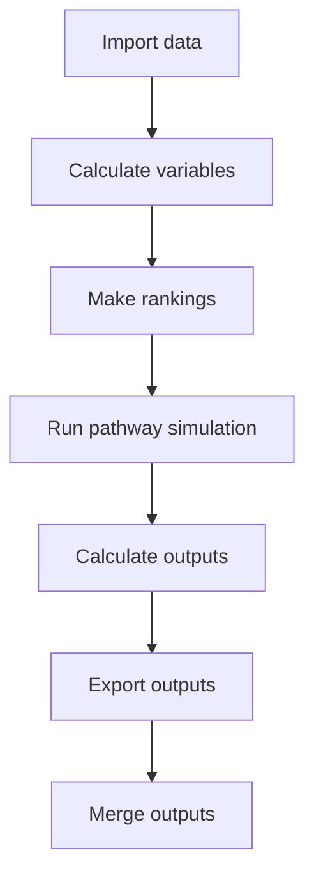

# Overview
This section aims to give an overview of the chemical decarbonization model. Chemical companies today provide essential 
products and services across sectors, but there are numerous sustainability issues to be addressed.
The purpose of the model is to simulate different pathways to decarbonize the manufacturing of chemicals in the fastest/
most economic way possible. Following question shall be answered using the model:
- What technologies are critical? 
- How much will the decarbonization cost? 
- Are the feedstocks required feasible? 
- When does it need to start happening?

In the following, we will make a quick deep dive into the scope, the structure and the underlying methodology of the model. 
 
## Scope
The chemical decarbonization model takes a regional perspective. It is grouped into 10 (sub-)continental regions. This model simulates 
various deterministic techno-economic pathways for sustainably manufacturing chemicals. The chemicals considered in the 
model are:

- Ammonia
- Ethylene
- Propylene
- Butadiene
- Benzene
- Toluene
- Xylene
- Methanol

These were chosen as they represent about quarter of the volume and half of the emissions of the total chemical industry. Additionally, some first degree Ammonia derivatives can be simulated utilizing this model: Urea and Ammonium Nitrate.
   

## Model concepts & structure
The model runs a simulation across the aforementioned chemicals, where different **technologies** are competing to produce the chemicals. The model has different uncertainty and lever variables, that can be altered in the configuration file. A model run with its associated parameters is called a **pathway**.  Every year, the plants are being either **decommissioned**, **retrofitted** or **built new** according to how these technologies have been ranked against one another, 
in order to meet the year-on-year **demand** for a particular chemical. The technologies that are chosen for this are based on the yearly ranking of technologies by emissions abated and/or levelized cost of chemical.

The model steps are outlined in the figure below. 

### Import data
During the project, data on prices, emissivity, and the different business cases (technologies) were collected and assembled in an Excel file. An overview of the imported data is presented in the [`Import data`](https://github.com/systemiqofficial/chemicals-decarbonization/blob/main/docs/1_import_data.md) section. The model transforms the raw dataset from the 
Excel file into CSVs, for easy and faster access later on.

### Calculate variables
The imported data is used to calculate derived variables:
- Total emissions of a process to produce 1 ton of the chemical (scope 1, 2, and 3 upstream)
- Total cost of ownership - TCO (CAPEX, fixed O&M, and variable OPEX [raw materials, energy, additional costs {e.g., CCS transport and storage costs}])
- Levelized cost of chemical produced - LCOX (derived from TCO)

These are calculated for every technology, per region per year. More details in the [`Calculate variables`](https://github.com/systemiqofficial/chemicals-decarbonization/blob/main/docs/2_calculate_variables.md) section.

### Make rankings
Technologies are ranked for every technology, per year and per region, based on the ranking criterion: cost, emissions or cost per emissions. A detailed explanation is in [`Make rankings`](https://github.com/systemiqofficial/chemicals-decarbonization/blob/main/docs/3_make_rankings.md). 

### Run pathway simulation
- Run from 2020 until 2050 (default start and end year)
- Every year, plants are either:
  - Retrofitted to another technology,
  - Decommissioned, or
  - Built new
- Inter-chemical interactions (e.g., methanol with olefins via MTO technology) are also taken into account

More in [`Run pathway simulation`](https://github.com/systemiqofficial/chemicals-decarbonization/blob/main/docs/4_run_pathway_simulation.md)

### Calculate outputs
- Levelized cost of chemical (averaged across plants)
- Total emissions - per year and cumulative over time (scope 1, 2, and 3 upstream)
- Captured emissions from CCS
- Feedstock consumption as raw material and/or energy fuel
- Total investment costs

More in [`Calculate outputs`](https://github.com/systemiqofficial/chemicals-decarbonization/blob/main/docs/5_calculate_outputs.md).

### Export outputs
Calculated outputs are pivoted to be in an easier format for analysis. More in [`Export outputs`](https://github.com/systemiqofficial/chemicals-decarbonization/blob/main/docs/6_export_outputs.md).
 

### Merge outputs
This step merges outputs from different pathway and sensitivity runs, and creates an Excel overview of the results. More in [`Merge outputs`](https://github.com/systemiqofficial/chemicals-decarbonization/blob/main/docs/7_merge_outputs.md).
  

## Model configuration
Model configuration is stored in `config.py`, in the form of constants such as `RETROFIT_CAP = 0.05`. The template for this is in `config_template.py`. When you want to run the model you will have to create a file `config.py` and copy the values from the template in there. This config file is added to `.gitignore`, such that changes are not added to Git every model run. When adding a new value to `config.py`, make sure to also add it to the template! 

Next: [`Import data`](https://github.com/systemiqofficial/chemicals-decarbonization/blob/main/docs/1_import_data.md)