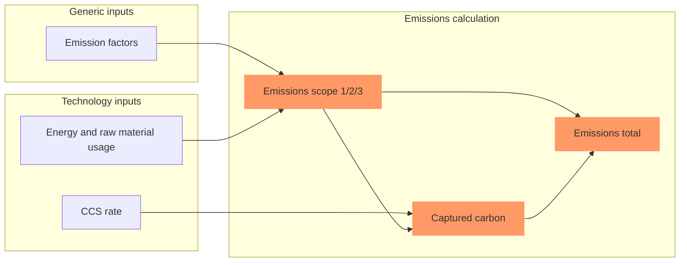
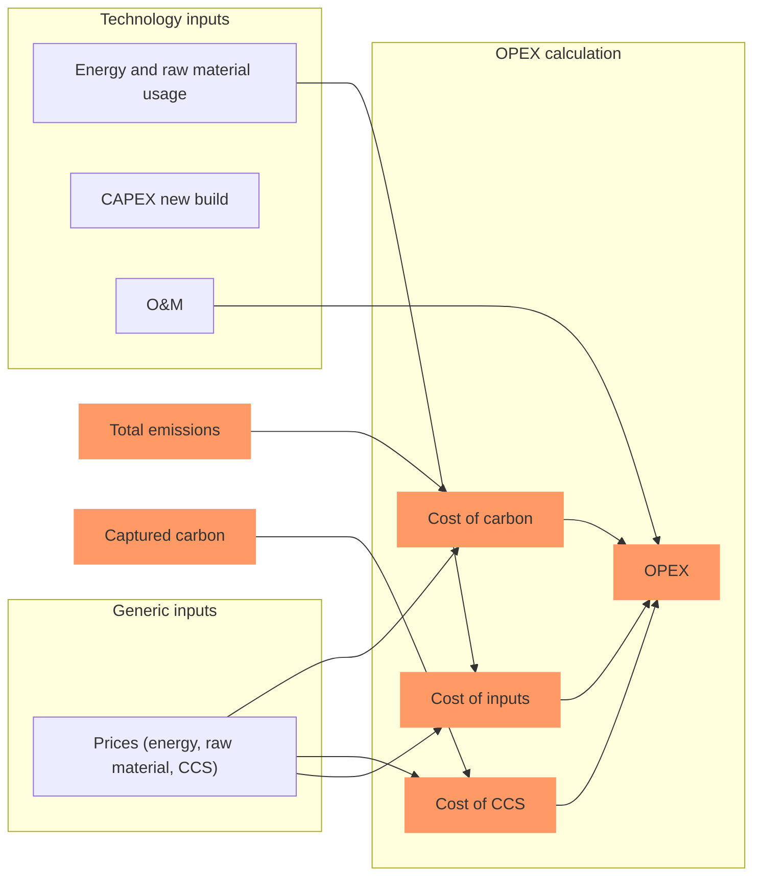
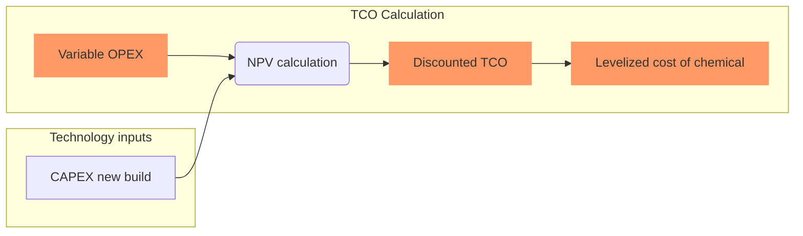

# Calculate variables
In this step, the imported input data is used to calculate variables that are used in the model. This is a three-step process:
1. Calculate emissions
2. Calculate cost (TCO and levelized cost of chemical)
3. Yearly consumption of inputs
 
## Emissions calculation
Emissions are calculated according to the flowchart below, for each chemical, technology, year and region. They are saved in `outputs/intermediate/emissions.csv`. 

If a retrofit has several sub-modules that are changed, the costs for each of those changes are added up to get to the total retrofit cost. 

## Cost calculation
Costs are calculated according to the flowchart below, for each chemical, technology, year and region. They are saved in `outputs/intermediate/cost.csv`. 

First, variable OPEX is calculated (costs are discounted using a discounting value configurable in `config.py`):

This and the CAPEX is used to calculate TCO and levelized cost:

## Yearly consumption calculation
As a last step, yearly consumption of all inputs is calculated by multiplying the inputs per ton of chemical by the total yearly volume produced of that chemical. 

Next: [`Make rankings`](https://github.com/systemiqofficial/chemicals-decarbonization/blob/main/docs/3_make_rankings.md)